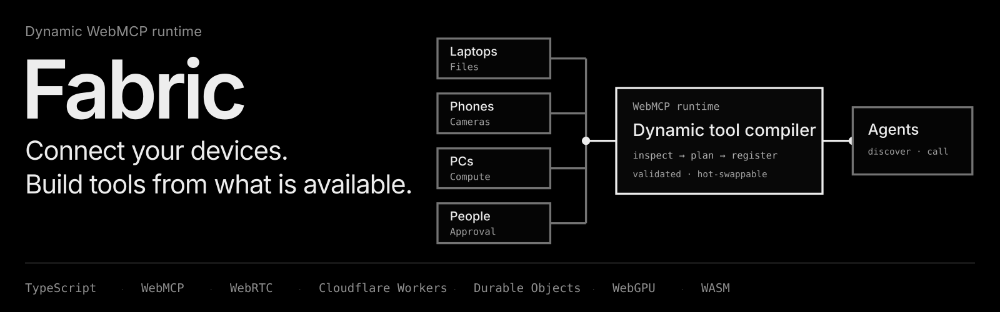

<p align="center">
  <a href="https://fabric.keshav-agr2007.workers.dev">
    
  </a>
</p>

> Fabric connects your devices so agents can build, run, and hot-swap WebMCP tools from whatever files, cameras, compute, and people are available right now.

[Try Fabric Live](https://fabric.keshav-agr2007.workers.dev) · [Watch the Demo](https://youtu.be/Gzw9uTK5uZ4) · [MIT License](LICENSE)

Fabric turns your surrounding hardware and human senses into a **plug-and-play capability mesh** for AI agents.

Today, interacting with an agent feels like talking through a glass wall: the agent reasons inside a single tab, while your files, cameras, and physical documents are scattered across separate screens. 

Fabric breaks that wall. Any phone, laptop, desktop, or tablet can instantly attach to an edge room coordinated by **Cloudflare Durable Objects**, exposing cameras, on-device compute, local files, stylus surfaces, and human judgment as **plug-and-play primitives**.

The agent inspects the room, **compiles a custom WebMCP tool tailored to your goal**, and executes it directly across your hardware. It can run private vision models locally on a phone, prompt your camera to capture a paper receipt, push a document comparison to your tablet for a stylus review, and wait for your explicit sign-off before exporting.

If a device leaves, the Durable Object preserves the room state while Fabric **hot-swaps the execution graph in real time** under the exact same tool schema. **Human-agent coordination** is no longer about babysitting a chatbot in a text box; it is about orchestrating live, physical capabilities inside the execution loop.

## The Device Capability Matrix

Every device in the mesh contributes its natural strengths, sandboxed by explicit browser grants:

| Node Type | Shared Capabilities | Client-Side Runtime | Status |
|---|---|---|---|
| **Smartphone** | Optical camera capture, local photo library, instant push prompts | Quantized WASM (q8 CLIP) to prevent mobile tab crashes | Live |
| **Desktop Workstation** | High-throughput batch vectorization, fast similarity ranking | Hardware-accelerated WebGPU (fp16 CLIP) | Live |
| **Laptop** | Local filesystems, document packets, host agent coordination | Host execution engine + In-browser Tesseract OCR | Live |
| **Human (HITL)** | Physical document capture, real-world perception, approval gates | Interactive native prompts (`human.request`) | Live |
| **Tablet** | Stylus annotations, touch review, secondary document viewport | Quantized WASM (q8 CLIP) + touch event capture | Planned (Roadmap) |

---

## Human-in-the-Loop (HITL) as a Native Primitive

Most agent architectures treat human interaction as an unhandled error state, forcing the model to abort and dump raw text back to the chat. Fabric treats humans as native execution nodes inside the WebMCP DAG:

* **Interactive Real-World Capture:** The agent can delegate a physical task mid-pipeline. The tool sends a `human.request` to a connected phone or tablet, prompting the user with a live camera viewfinder to photograph a physical paper form.
* **On-Device Processing:** The captured image is immediately processed on that device via in-browser Tesseract.js Web Workers, extracting text before returning data to the host.
* **Explicit Approval Gates:** High-stakes actions (such as generating signed PDFs or moving financial records) require human sign-off. The pipeline halts at a verification modal, displaying extracted metadata. Only when the user taps Approve does the tool finish execution.
* **Zero Disruption:** The human collaborates inside the live tool execution loop without breaking conversational turn state.

## Two Demonstrated Workflows

### 1. Zero-Cloud Photo Search & Self-Healing Failover
1. **Goal & Inspection:** You ask ChatGPT to search photos across your devices. The agent calls `inspect_fabric` to inspect connected nodes and their explicitly shared capabilities.
2. **Tool Compilation:** Fabric compiles a brand-new tool, `search_shared_photos`, directly from the active capability graph. After validating the pipeline dependencies and device leases, Fabric exposes the compiled tool to the agent via `document.modelContext.registerTool()`.
3. **Local-First P2P Execution:** The phone runs an on-device quantized CLIP vision model in WASM, computing embeddings locally. Your full-resolution camera roll never leaves the device. Only compact vector scores travel over WebRTC DataChannels for host-side ranking, followed by the winning thumbnail preview.
4. **Self-Healing Failover (Hot-Swap):** When a device disconnects mid-session, Fabric detects the dropped node, aborts the previous registration via `AbortController`, re-compiles Version 2 of the tool around the surviving hardware, and hot-swaps it under the exact same tool name and schema. The agent continues the conversation uninterrupted.

### 2. Human-in-the-Loop Document Assembly
1. **Multi-Source Intent:** You ask the agent to assemble disparate records into a verified PDF packet, combining digital files on your laptop with a missing physical form on your desk.
2. **Tool Compilation:** Fabric compiles the `create_document_packet` tool from the live device graph, weaving together local file reads, remote optical capture on your phone, and explicit human sign-off into a single validated pipeline.
3. **Interactive Physical Capture:** When the compiled tool reaches the missing physical document, it pauses at a `human.request` stage. Your phone screen lights up with a live camera prompt. You photograph the paper form, and the capture is transferred directly into the assembly pipeline over a WebRTC DataChannel.
4. **Human Verification & Export:** Before producing the artifact, the compiled pipeline pauses at an interactive approval gate on your host screen. You review the packet contents, tap **Approve**, and Fabric compiles the final multi-page PDF locally.

## Why WebMCP

Most WebMCP applications expose a static list of developer-defined tools. Fabric uses WebMCP as a **dynamic runtime compilation target**:

* **Just-In-Time Synthesis:** Tools are synthesized on demand based on what hardware and people are in the room.
* **Stable Interface during Failover:** Replacing an active pipeline using an `AbortController` allows hot-swapping implementations without changing the tool name or schema, preventing agent errors.
* **Browser as Permission Sandbox:** The agent never gets raw operating system access. It interacts exclusively with explicit browser grants (`data.read`, `compute.embed`, `human.request`).
* **Dynamic Discovery:** Agents discover newly compiled tools in the same turn via the browser's `toolchange` lifecycle.

## How WebMCP Is Implemented

All protocol logic is cleanly isolated in `app/src/webmcp/registry.ts`:

```javascript
document.modelContext.registerTool({
  name: pipeline.toolName,
  description: pipeline.description,
  inputSchema: pipeline.inputSchema,
  execute: async (input) => {
    return await executeCompiledDag(pipeline.toolName, input);
  },
}, { signal: controller.signal });
```

### Core WebMCP Meta-Tools

| Tool | Purpose |
|---|---|
| `inspect_fabric` | Lists connected devices and explicitly shared capabilities |
| `compile_tool` | Plans, validates, and registers a task-specific WebMCP tool |
| `inspect_tool` | Returns the execution DAG, stage dependencies, and node health |
| `revoke_tool` | Cancels an active registration via `AbortController` |
| `request_from_human` | Dispatches capture, decision, or approval requests to a person |

**Validated Execution Pipelines:** Instead of generating unverified code strings, the planner outputs a structured pipeline blueprint. Fabric checks every step, data flow, and device lease before calling `registerTool`.

## Cloudflare Edge Architecture

* **Durable Objects:** Each room is anchored by a Durable Object that manages room membership, WebRTC SDP signaling, and persistent tool definitions across host reloads.
* **WebSocket Hibernation:** Idle rooms evict active compute while preserving client WebSockets, keeping dormant rooms parked at the edge for near-zero cost.
* **Direct P2P with Relay Fallback:** WebRTC DataChannels stream binary tensors and images directly between browsers. If symmetric NATs block direct connections, the Durable Object acts as an encrypted fallback relay.
* **Streaming Model Proxy:** The Worker reverse-proxies model shards with strict same-origin headers required by browser WebGPU timers.

## Measured on Real Hardware

| Operation | Environment | Observed Result |
|---|---|---|
| CLIP Embed (small batch) | Warm WebGPU Desktop (fp16) | 1.6 - 2.1 seconds |
| OCR Extraction | Tesseract Worker Mobile (WASM) | 1.2 seconds |
| Planner Synthesis | Cloudflare Worker / OpenAI | 10 - 20 seconds |
| Topology Replan (Hot-swap) | Cloudflare Worker / OpenAI | ~6 seconds |
| First-time Model Delivery | Edge-cached streaming proxy | ~89 MB (cached indefinitely) |
| Node Loss Detection | Heartbeat roster monitor | < 5 seconds |

## Testing Instructions for Hackathon Judges

You can test Fabric across two physical devices (such as a laptop and phone) or simply between two browser tabs:

1. **Open the Live App:** Open [fabric.keshav-agr2007.workers.dev](https://fabric.keshav-agr2007.workers.dev) in ChatGPT's in-app browser or in Google Chrome 149+ with the experimental flag enabled via `chrome://flags/#enable-webmcp-testing`.
2. **Attach a Node:** Scan the room QR code with your phone (or open the join link in a second browser window).
3. **Load Test Data:** On the joined node, tap **"Use sample files"** to populate test receipts, documents, and photos.
4. **Test Dynamic Tool Compilation:** In ChatGPT or your WebMCP agent, prompt:
   > Inspect the connected fabric and compile a tool to search my photos by description.
5. **Test Local-First Execution:** Once the tool registers via WebMCP, prompt:
   > Find the photo of the dog.

   *Observe:* The phone embeds the photos locally via WASM and streams vector scores over WebRTC. The source photos never leave the device.
6. **Test Human-in-the-Loop (HITL) Workflow:** Prompt the agent:
   > Compile and sign the document packet.

   *Observe:* The agent initiates the pipeline, sends an interactive capture prompt to the mobile screen to photograph a paper receipt, runs on-device OCR, and halts at an interactive approval gate on your host screen before generating the final PDF.

## Where to Look in the Code

| Component | File Path |
|---|---|
| WebMCP registration, revoke, and hot-swap | `app/src/webmcp/registry.ts` |
| Core meta-tools and compiled DAG execution | `app/src/webmcp/surface.ts` |
| Pipeline models and DAG validator | `app/src/compile/pipeline.ts`, `app/src/compile/validate.ts` |
| DAG executor and approval gates | `app/src/compile/executor.ts` |
| Topology failover, degrade, and healing | `app/src/compile/hotReload.ts` |
| Edge planner endpoint and frozen schema prompt | `worker/plan.ts` |
| Capability grants and on-device primitives | `app/src/capabilities/` |
| WebRTC DataChannels and Durable Object relay | `app/src/transport/`, `worker/room.ts` |

## Run Locally

### Prerequisites
* Node.js 18+
* An OpenAI API key (for the planner)

```sh
git clone https://github.com/divagr18/fabric.git
cd fabric
npm install

# 1. Start Cloudflare Worker (port 8787)
# Create worker/.dev.vars with: OPENAI_API_KEY="your-key"
npm run dev:worker

# 2. Start Vite Frontend (port 5173, proxies /api to Worker)
npm run dev
```

### Verification Commands
```sh
npm run build
npm run typecheck:worker
npx tsx tests/validate.test.ts
npx tsx tests/blob.test.ts
npx tsx tests/plan.smoke.ts
```

## Known Limitations

* **Room Credentials:** A 4-digit room code serves as the ephemeral room credential for this hackathon build.
* **Strict Permission Boundaries:** A device exposes only files, cameras, and compute that its user explicitly grants. Fabric cannot inspect unshared directories, background tabs, or system files.
* **Closed Primitive Vocabulary:** Compiled tools execute Fabric's typed primitives; the planner cannot execute unvalidated, arbitrary JavaScript strings.
* **First-Run Model Download:** Loading client-side vision models requires an initial ~89 MB download per device, which is subsequently cached by the browser Cache API.

## License

[MIT](LICENSE)
